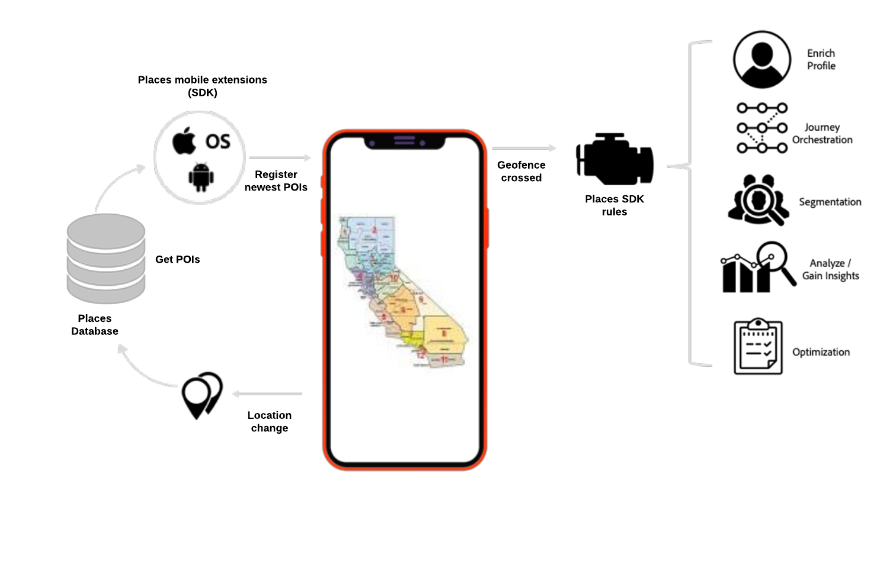

# Overview

Location is an important context for understanding the engagement of mobile users. Using this context the mobile apps developers can enhance the app designs by making it more personalized and engaging. 'Places' is a geo-location service that enables mobile app developers to understand the location context using rich and easy-to-use SDK interfaces accompanied by a flexible database of Points of Interests \(POIs\).

Places in Adobe's experience cloud geo-location service allows you to achieve the following:

* Create and Manage a database of POIs that can be leveraged with other Experience Cloud solutions.
* Attach custom meta-data to the POIs to make them richer and more meanigful by specifying additional attributes. 
* Visualize the POIs on a map to easily understand the spatial context and add/edit meta-data attributes. 
* Configure the SDK in Adobe Launch to define your location triggered rules and meta-data based conditions.
* Reduce the code that you need to write to monitor devices location and use Adobe's location monitor to auto-trigger the location specific rules.

This will allow you to take actions from location signals in real time, when and where it matters. The right context can make the mobile engagement more enriching.

Some intersting applications of 'Places' could be:

* Send a real time notification when someone enters a POI. "Hey..welcome to the stadium". 
* Analyze foot traffic of your own stores versus your competitor stores.
* Segment an audience based on offline behavior by using audience profiles enriched with location context.
* Target user with an in-store experience when relevant.

## Places Components

Places comprises the following components:

* Places web-service: Create and manage POIs using the REST APIs. For more information about the REST APIs, see [Places UI](https://launch.gitbook.io/places-services-by-adobe-documentation/places-database-management-1).
* Places UI: Visualize POIs on a map to understand the spatial context and to add/edit POIs and their custom meta-data.
* Places SDK: The multi-platform mobile API interface to integrate the location context in your mobile apps.  For more information about the SDKs, see [Places SDK extensions \(Beta\)](https://aep-sdks.gitbook.io/docs/using-mobile-extensions/places-extension).
* Places rules: The geo-intelligent Adobe Launch rules which will enable you to trigger actions with entry and exit events. They also allow to use geo-attributes in conditions to personalize the experience. 
* Places Monitor: The multi-platform mobile SDK which can be embedded in your mobile app to auto-monitor your users location changes and trigger Places rules.  For more information, see [Places SDK extensions \(Beta\)](https://aep-sdks.gitbook.io/docs/using-mobile-extensions/places-extension).

## Terminology

Here are some common terms that are used in the Places documentation:

* A **point of interest \(POI\)** is a geo-location that is of interest to your organization. You can define POIs with attributes such as a name, radius, address, category and metadata tags.
* A **geofence** is a type of POI. This type is a virtual geographic boundary defined by latitude and longitude coordinates.
* A **beacon** is a type of POI. This type is a physical device that represents a location by emitting a low power bluetooth signal. Beacons support is coming in future releases.
* A **library** is a collection of POIs which grouped together to easily attach rules to a set instead of a single POI. 
* A SDK **extension**, is the Adobe Launch extension that's required to integrate the 'Places' into your mobile apps. It's used in conjunction with the other AEP SDKs to add location context to your experiences.
* An **organization** is the Adobe entity that identifies your company within Adobe Experience Cloud. Most often, an organization is your company name. However, we allow a company to have more than one organization. The organization administrator can configure groups and users and configure single sign-on functionality.
* The **orgID** is the ID that represents your organization across AEP.  For more information, see [Finding your orgID](https://forums.adobe.com/thread/2339895).
* The **Experience Cloud ID** service provides a universal, persistent ID that identifies your visitors across all the solutions in the Experience Cloud.  For more information, see [Overview](https://marketing.adobe.com/resources/help/en_US/mcvid/).

## Places workflow

Here is a high-level view of the Places workflow:

