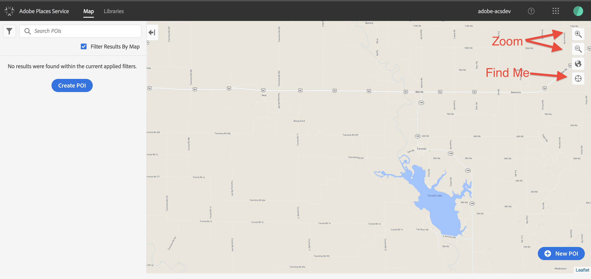

# Getting started

## Get provisioned to use Adobe Places

Places requires special provisioning context along with your regular AEP provisioning context.

* Ensure your organization is provisioned with Places in the Admin Console. If you are not the Adobe administrator, contact the administrator to ensure the 'Places' context in Admin Console.
* Ensure you are listed as a user under the 'Places' and 'Launch' product contexts in the Admin Console.
* Ensure your mobile app property is configured in Adobe Launch with 'Places' extension installed. For more information, see [Adobe Places \(Beta\)](https://aep-sdks.gitbook.io/docs/using-mobile-extensions/places-extension-1). 
* If your company has multiple Adobe organizations, ensure that you always choose the one provisioned for 'Places' for adding your POIs and Libraries.

To help you complete a batch import of your POIs from a `.csv` file into your organization's Places database, we created a set of Python scripts. You can download the zip file of these scripts [here](https://github.com/jiabingeng/places-developer-docs/tree/a3606cf2bdb7247bc7070e1bb66c4f6c40fdb3bb/.gitbook/assets/import.zip). For instructions on how to use the scripts, see the included readme file.

## Understanding the Places UI

To access the Places UI, in a browser, go to [ https://places.adobe.com](%20https://places.adobe.com) and log in with your Adobe ID. 

Here is some basic information to help you get familiarized with the UI:

* In the upper right corner of the screen, there are buttons for zooming in and out, centering on your current location \(`Find Me`\), and switching between Map View and Satellite View.
* By moving the "hand" pointer onto the map, you can double click to zoom in, or click and drag to recenter the map.
* You can also use the arrow keys to scroll the map
* In the lower right corner, there is a button to create a new POI. Don't click it just yet; we need to create a library to hold your POIs first.

## Create an empty library in the Places database by using the Places UI

1. Log into Adobe Places UI \(The user interface to visually add and manage the POIs and libraries\). 
2. Click on the **Libraries** tab.
3. Click **Create Library**.
4. Type the name.
5. Click **Confirm**.

## Create a new POI in the library by using the Places UI

A point of interest \(POI\) is a location or a point on a map that is of interest to you. It can include locations like cafes, restaurants, and so on.

1. Log in to Adobe Places UI\([https://places.adobe.com](https://places.adobe.com)\).
2. In the top left side, click **Map**.
3. In the map view, on the lower right side, click **+ New POI**. 
4. Expand the **Details** section.
5. Type a name.
6. Select a library.
7. Enter or select a radius. 
8. Select the icon that you want to use for your POI.
9. Select a color for your POI icon.
10. Type a category.
11. Expand the **Location** section.
12. Type an address.
13. Type the city.
14. Type the name of the state.
15. Type the name of the country.
16. Select or enter a latitude or longitude.
17. Click **Drop Pin on Map**.
18. Expand the **Metadata** section and click **Add Metadata.**
19. **Type the key name.**
20. **Type the key value.**
21. Click **Confirm**.

