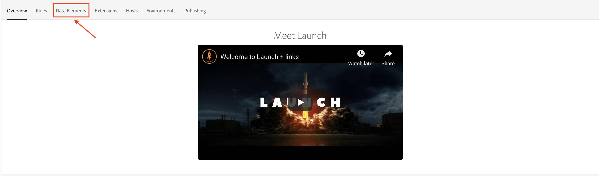
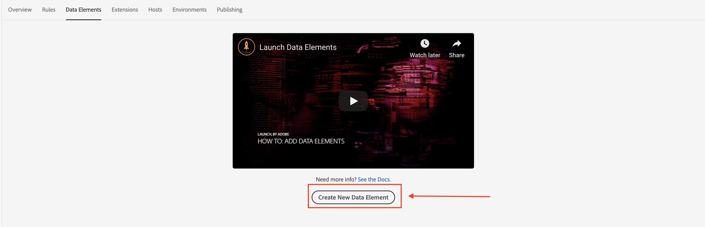
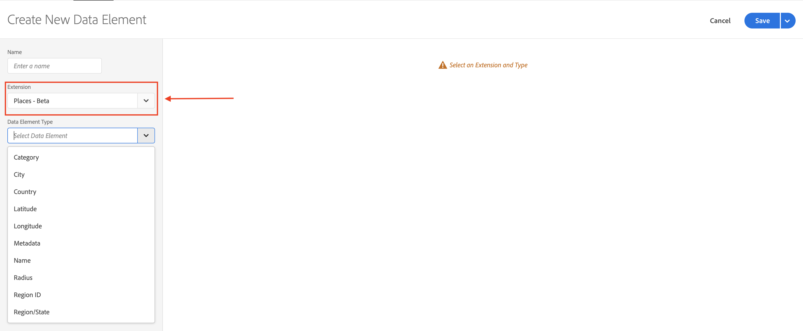
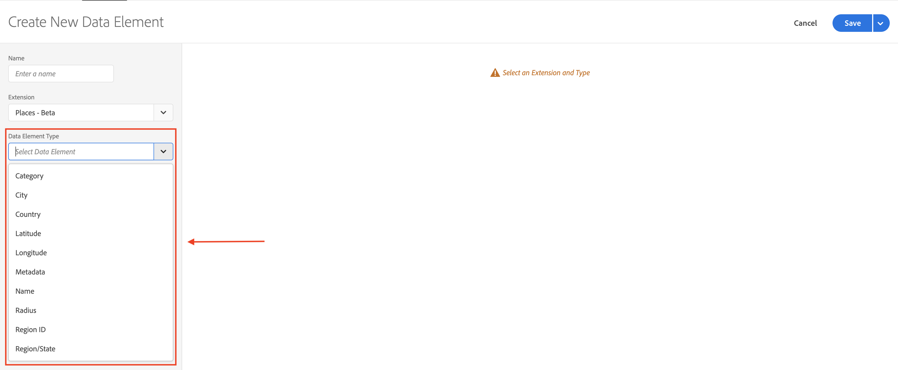
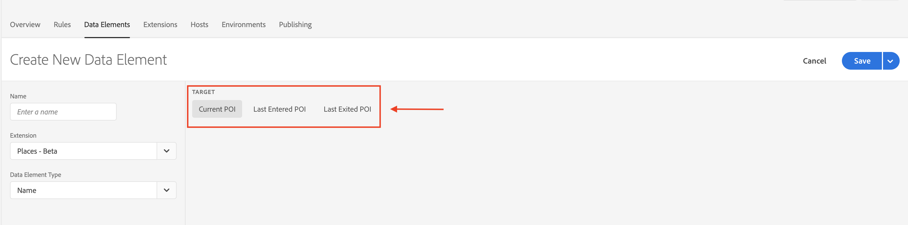
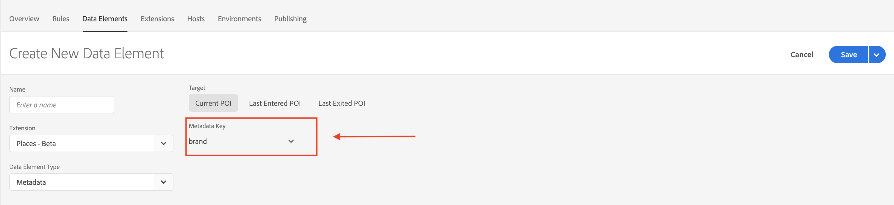
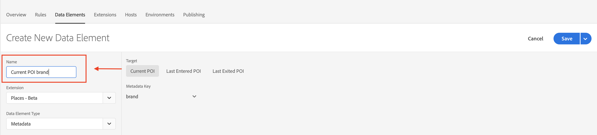
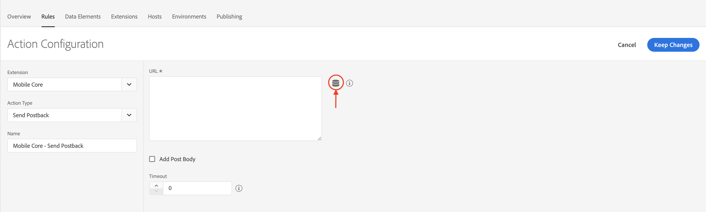
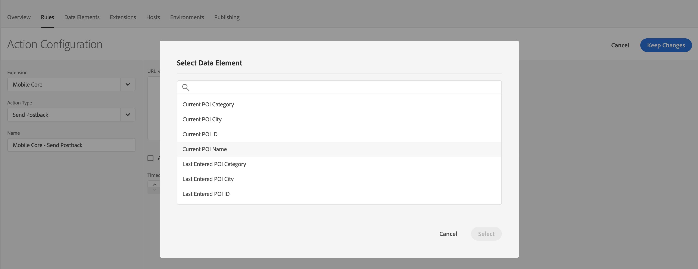
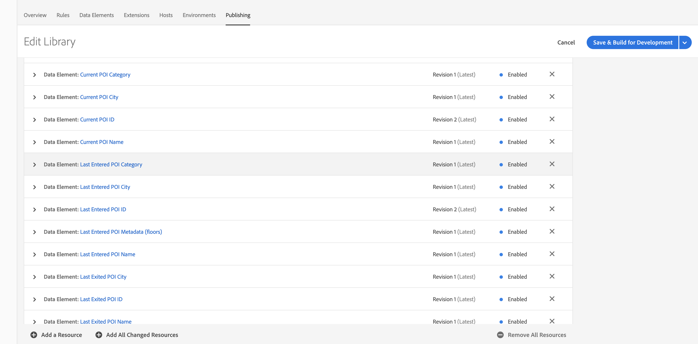

# Defining Data Elements

### Data Elements

Data elements are the building blocks for the applications data dictionary and are used to collect, organize, and deliver data across marketing and ad technology.

A data element is a variable where the value can be mapped to a Visitor ID, a Carrier Name, an Advertising ID, a Push ID and so on. In Experience Platform Launch, you can reference this value by its variable name. This collection of data elements becomes the dictionary of defined data that you can use to build your rules \(events, conditions, and actions\), and this dictionary is shared across Experience Platform Launch where it can be used with any extension in your property.

With Places extension, you can reference values from the following targets:

* Current POI, which refers to the POI in which your customer is currently located. If the user is located in multiple POIs, the one belongs to the library with higher rank is picked. If multiple POIs belong to the highest rank library, the one with the smallest radius is picked.
* Last exited POI, which refers to the most recent POI that the user exited.
* Last entered POI, which refers to the most recent POI that the user entered. 

Each POI contains the following data references

* Category: category of the POI
* City: city of the POI
* Country: country of the POI
* Latitude: latitude of the POI
* Longitude: longitude of the POI
* Metadata: custom metadata of the POI
* Name: region of the POI
* Radius: radius of the POI
* Region ID: ID of the POI
* Region/State: region, province or state of the POI

### Create a data element

1. From a Property page, open the Data Elements tab.

2. Click **Create New Data Element**.

3. From the extension menu, select Places.

4. From the Data Element Type drop-down list, select a data reference for this data element.

5. Select a POI target.

6. If this data element is a custom metadata reference, pick a metadata key.

7. Type a name for the data element, and click Save .

### Use a data element

After a data element is created, you can use it from any rule component if a data element picker is present.

If a data element picker is not present in the rule component, you may still use the data element by wrapping the data element name with the **%%** tokens.
For example, if the data elmement name is **Last POI City**, you may add **%%LAST POI City%%** to a text input.

### Publish data elements

If data elements are used in any of the rule components. They must also be included in the library and published.

