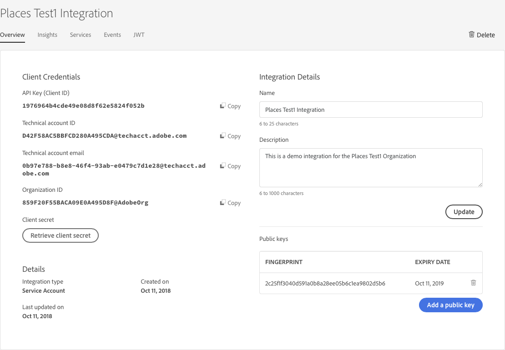

# Create a Places integration

## Generate a public and private key pair

To create a Places integration, you need a public and a private key pair. These pairs can be purchased, or you can generate your own self-signed keys.

To generate your own self-signed keys:

1. In a terminal window, copy and paste each of the following lines and press **Enter** after pasting each line:

   ```text
      mkdir keys
      cd keys
      openssl req -x509 -sha256 -nodes -days 365 -newkey rsa:2048 -keyout places_integration_test_private.key -out    places_integration_test_public.crt
   ```

   **Tip**: We recommend that you name your keys for easy reference and store them in a folder. If you create multiple integrations, you can easily identify and manage which keys belong to which integration.  

2. Type the information that is requested by OpenSSL:

   ```text
   Country Name (2 letter code:  // Example: US
   State or Province Name (full name):  // Example: California
   Locality Name (eg, city):  // Example: San Jose
   Organization Name (eg, company):  // Example: Places
   Organizational Unit Name (eg, section):  // Example: Engineering
   Common Name (eg, fully qualified host name):  // Example: places.com
   Email Address:  // Example:  poi@places.com
   ```

   For more information about OpenSSL, see [OpenSSL](https://www.openssl.org/).  


   **Important**: The information that you provide is incorporated into the keys.  

3. Navigate to the directory where the `.key` and `.crt` files are located. For example, in iOS, go to **Macintosh HD** &gt; **users** &gt; \(**your user name**\) &gt; **Keys**.

The following video guides you through the process of generating the key pair:


## Create a Places integration in the Adobe I/O console

To create a Places integration:

1. Go to [https://console.adobe.io/](https://console.adobe.io/) and sign in with your Adobe ID.
2. If you have access to more than one Experience Cloud organization, select the organization from the drop-down list on the left.
3. Click **New Integration**.
4. Select **Access an API** and click **Continue**.
5. Under **Experience Cloud**, select **Places** as the Adobe service to which you want to integrate and click **Continue**.
6. Select **New integration** and click **Continue**.
7. On the _Create a new integration_ screen, enter a name and description. 
8. Drag and drop your `xxxx_public.crt` file, created above, to the **Public keys certificates** drop zone.
9. At the bottom of the page, click **Create integration**.
10. After a few seconds, in the _Integration created_ screen, verify that the following message appears:

    `Your integration has been created.`

11. Click **Continue to integration details**.  An overview of your integration with the API key, your organization ID, the technical account ID, and other details about your integrations are displayed.

## Record the organization ID and the API key

1. On the **Services** tab, confirm that **Places** is displayed.
2. On the **Overview** tab, locate and record the API Key \(Client ID\) and the Organization ID.

   These IDs will be needed for each Places Rest API request.



## Generate a JWT token

On the **JWT** tab, the Adobe I/O console allows you to test your integration by generating a JWT and providing the exchange URL.

To generate a JWT token:

1. In a text editor, open your `private.key` file that you created above.
2. On the **JWT** tab, copy the contents of the key and paste it in the **Paste private key** field. 
3. Click **Generate JWT**.
4. In the **Sample CURL command** section, click **Copy**, ****and paste the contents in your command prompt or terminal window.
5. Run the command by pressing **Enter** on your keyboard.
6. Locate the `"token_type": "bearer"` and the `"access_token"` value.   The value of the bearer access token is what you will use in your Places API requests.  

**Important**: Adobe access tokens are valid **only** for 24 hours, so save the sample CURL command \(step 5\). If the access token is no longer valid, you need to generate the token again.

