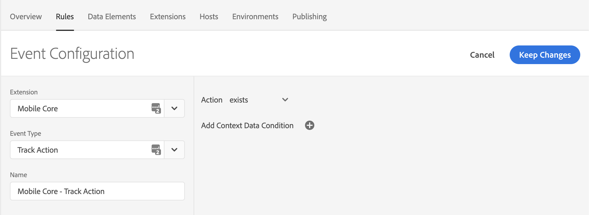
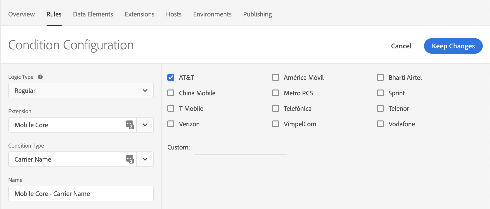
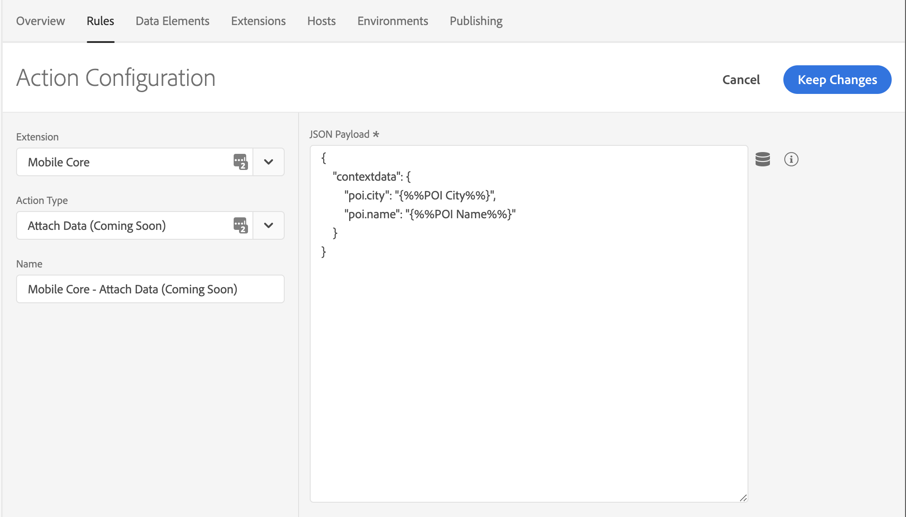
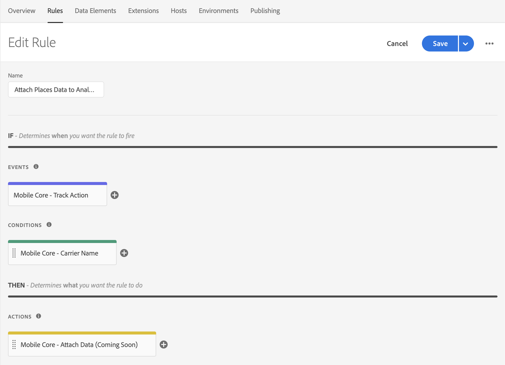

# Attaching Places data to Analytics Events via Launch Rules


This document assumes that you have Adobe Places implemented in your application. For more information about implementing Adobe Places, see [Places Extensions for AEP SDK](../../configure-places-in-the-sdk/README.md).


After Places sends the entry and exit events, you can create rules in Experience Platform Launch and attach your Places data to all Adobe Analytics events. To create this type of rule, select your property in Launch and complete the following steps:

1. [Create a new **Rule**](#create-a-rule)
2. [Select the **Event** you wish to trigger the rule](#select-an-event)
3. [Add any other **Conditions** required to trigger the action (optional)](#add-conditions)
4. [Select the **Action** to Attach Data and define your payload](#define-the-action)

## Create a Rule

1. On the **Rules** tab, click **Create New Rule**.

Remember the following information:
- If you do not have existing rules for this property, the button will be in the middle of the screen.
- If your property has rules, the button will be in the top right of the screen.

## Select an Event

1. Give your rule a meaningful name so it will be easily recognizable in your list of Rules. In this example, the Rule is named **Attach Places Data to Analytics Track Action Events**.

2. Under the **Events** section, click **Add**.

3. From the **Extension** drop-down list, select **Mobile Core**.

4. From the **Event Type** drop-down list, select **Track Action**.

Now you can determine the triggers that you want to include for this Rule. In this example, the trigger is based on all `TrackAction` calls. After you configure the Event, click **Keep Changes**.

 

## Add Conditions


Complete this step if you want to add Conditions to your rule. Otherwise, skip to [Define the Action](#define-the-action).


In this example, a Condition is created that causes the Rule to trigger only for AT&T customers.

1. Under the **Conditions** section, click **Add**.

2. From the **Extension** drop-down list, select **Mobile Core**.

3. From the **Condition Type** drop-down list, select **Carrier Name**.

4. In the window on the right, select the **AT&T** checkbox.

5. Click **Keep Changes**.

 

## Define the Action

1. Under the **Actions** section, click **Add**.

2. From the **Extension** drop-down list, select **Mobile Core**.  

3. From the **Action Type** drop-down list, select **Attach Data**.

4. On the right pane, in the **JSON Payload** field, type the data that will be added to this Event.

5. Click **Keep Changes**.

On the right pane, you can add a freeform JSON payload that adds data to an SDK event before an extension that is listening for this event can hear the event. In this example, some context data is added to this event before the Analytics extension processes it. The added context data will now be on the outgoing Analytics hit.

In the following example, **poi.city** and **poi.name** values are added to the context data of the Analytics event. The values for the new keys are dynamically determined by the SDK when this event processes.

 

## Save the Rule and rebuild your property

After you complete your configuration, verify that your Rule looks like the following image:

 

1. Click **Save**

2. Rebuild your Launch property and deploy it to the correct Environment.
