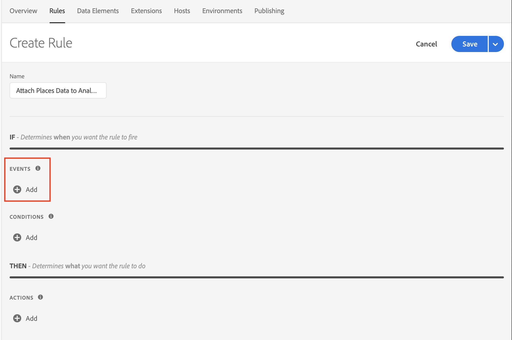
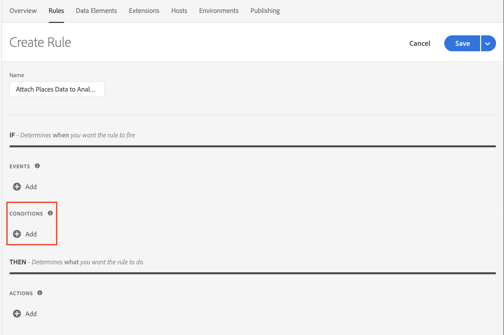
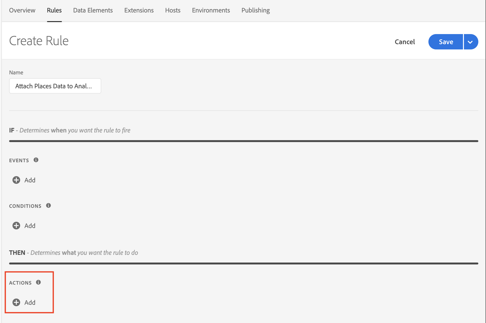

# Attaching Places Data to Analytics Events via Launch Rules

This document assumes that you have Adobe Places implemented in your application. If you need help implementing Adobe Places, see [Places Extensions for AEP SDK](../../configure-places-in-the-sdk/README.md).

Once Places is sending in events for entries and exits, you can leverage Rules in Launch to attach your Places data to all Adobe Analytics events. With your desired property selected in Launch, you can create this type of rule by completing four steps:

- [Create a new `Rule`](#create-a-rule)
- [Select the `Event` you wish to trigger the rule](#select-an-event)
- [Add any other `Conditions` required to trigger the action (optional)](#add-conditions)
- [Select the `Action` to Attach Data and define your payload](#define-the-action)

## Create a Rule

In the `Rules` tab, click the `Create New Rule` button.

If you don't have existing rules for this property, the button will be in the middle of the screen:

 

If your property already has rules, the button will be in the top right of the screen:

 

## Select an Event

You should give your rule a meaningful name so it will be easily recognizable in your list of Rules. This rule is named "Attach Places Data to Analytics Track Action Events".

Next, click the "Add" button under the "Events" section:

 

Select `Mobile Core` from the "Extension" dropdown, then select `Track Action` from the "Event Type" dropdown. At this point you can choose what restrictions you want to include that trigger this Rule. In this example, we are choosing to trigger on all TrackAction calls. When you're done configuring the Event, hit the "Keep Changes" button.

 

## Add Conditions

If you wish to add `Conditions` to your rule, complete this step. If you don't, skip to [Define the Action](#define-the-action).

In this example, we will add a condition that will cause our rule to trigger only for AT&T customers.

Click the "Add" button under the "Conditions" section:

 

Select `Mobile Core` from the "Extension" dropdown, and choose `Carrier Name` from the "Condition Type" dropdown. Check the `AT&T` box in the window on the right. When you're done, hit the "Keep Changes" button.

 

## Define the Action

The last thing we need to do is define the `Action`. First, click the "Add" button under the "Actions" section:

 

Select `Mobile Core` from the "Extension" dropdown and choose `Attach Data` from the "Action Type" dropdown.

In the UI on the right, you have the ability to add a freeform JSON payload that will add data to an SDK event before any extension listening for this event will hear it. In our example, we are adding some context data to this event before the Analytics extension process it. This results in our added context data being on the outgoing Analytics hit.

In the example below, we are adding "poi.city" and "poi.name" values to the context data of the Analytics event. The values for the new keys will be determined dynamically by the SDK at the time this event processes:

 

## Save the Rule and Rebuild your Property

Now that you are done with configuration, your screen should look like below:

 

The last thing for you to do is hit the "Save" button, then make sure to re-build your Launch property and deploy it to the correct Environment.
