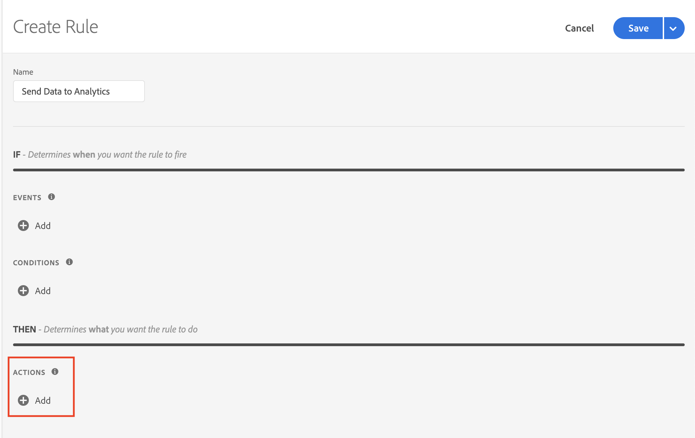

# Using Places Events to Send Data to Analytics via Launch Rules

This document assumes that you have Adobe Places implemented in your application. If you need help implementing Adobe Places, see [Places Extensions for AEP SDK](../../configure-places-in-the-sdk/README.md).

Once Places is sending in events for entries and exits, you can leverage Rules in Launch to send data to Adobe Analytics. With your desired property selected in Launch, you can create this rule by completing four steps:

- [Create a new `Rule`](#create-a-rule)
- [Select the `Event` you wish to trigger the rule](#select-an-event)
- [Add any other `Conditions` required to trigger the action (optional)](#add-conditions)
- [Select the `Action` to send data to Analytics and define your payload](#define-the-action)

## Create a Rule

In the `Rules` tab, click the `Create New Rule` button.

If you don't have existing rules for this property, the button will be in the middle of the screen:

 

If your property already has rules, the button will be in the top right of the screen:

 

## Select an Event

First, you can name your rule. We've named this rule "Send Data to Analytics".

Next, click the "Add" button under the "Events" section:

 

Select `Places` (or `Places - Beta`) from the "Extension" dropdown, then select `Enter POI` from the "Event Type" dropdown. Hit the "Keep Changes" button.

 

## Add Conditions

If you wish to add `Conditions` to your rule, complete this step. If you don't, skip to [Define the Action](#define-the-action).

Click the "Add" button under the "Conditions" section:

 

Select `Places` (or `Places - Beta`) from the "Extension" dropdown, and choose from the "Condition Type" dropdown which value you wish to make a condition on. When you're done, hit the "Keep Changes" button.

In our example, we are making a condition that the Current POI's name must equal "My POI":

 

## Define the Action

The last thing we need to do is define the `Action`. First, click the "Add" button under the "Actions" section:

 

Select `Adobe Analytics` from the "Extension" dropdown and choose `Track` from the "Action Type" dropdown. In the UI on the right, add whatever action or state you'd like to send to Analytics. You can also choose to add any additional context data to this request. Remember that you can use data elements to get this data dynamically from the SDK. When you're done, hit the "Keep Changes" button.

In the example below, we are going to send a "Track Action" call to Analytics with additional context data of `poi.name` equal to whatever the name is of the POI that triggered this entry event:

 

## Save the Rule and Rebuild your Property

Now that you are done with configuration, your screen should look like below:

 

The last thing for you to do is hit the "Save" button, then make sure to re-build your Launch property and deploy it to the correct Environment.
