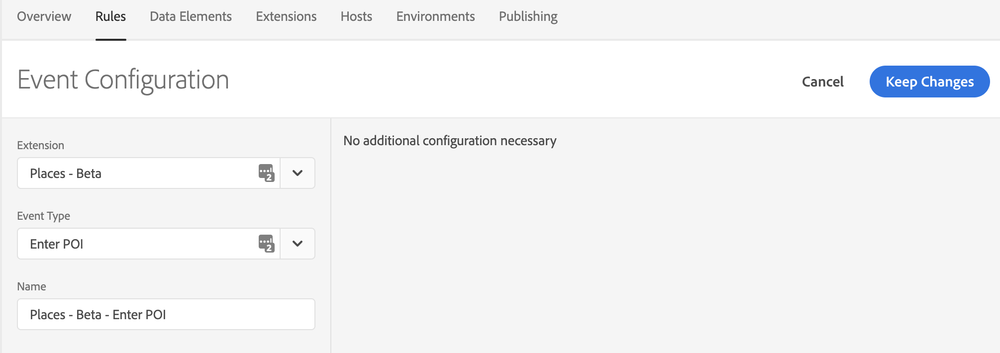
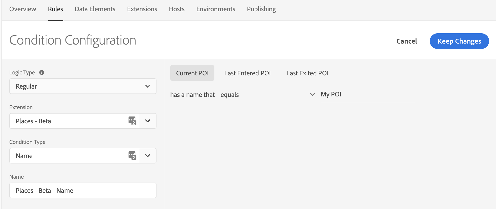
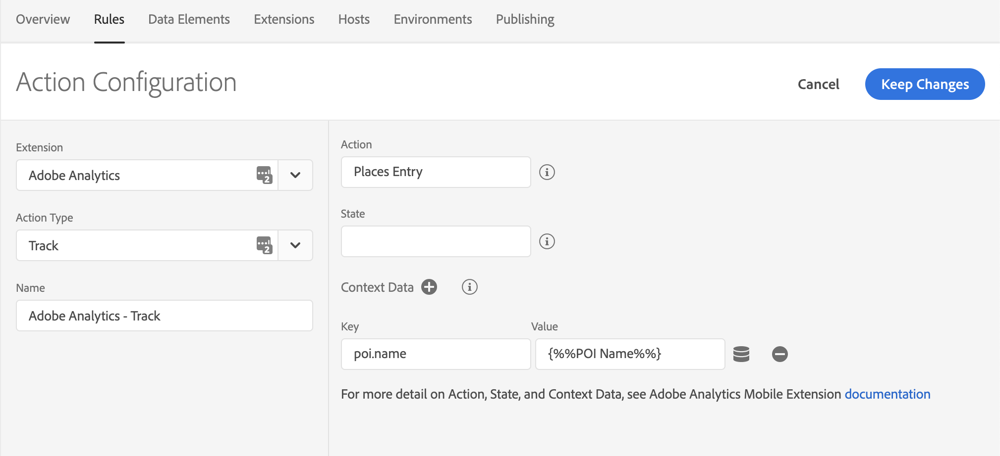
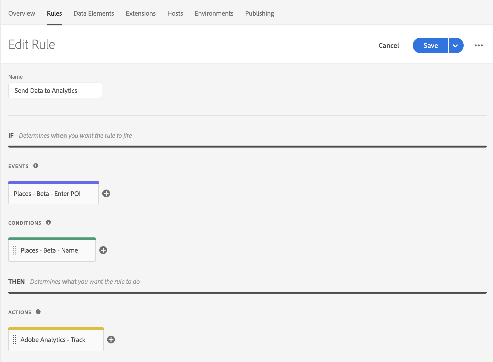

# Use Places events to send data to Analytics via Launch Rules


This document assumes that you have Adobe Places implemented in your application. For more information about implementing Adobe Places, see [Places Extensions for AEP SDK](../../configure-places-in-the-sdk/README.md).


After Places sends the entry and exit events, you can create rules in Experience Platform Launch to send Places data to Adobe Analytics. To create this type of rule, select your property in Launch and complete the following steps:

1. [Create a new **Rule**](#create-a-rule)
2. [Select the **Event** you wish to trigger the rule](#select-an-event)
3. [Add any other **Conditions** required to trigger the action (optional)](#add-conditions)
4. [Select the **Action** to send data to Analytics and define your payload](#define-the-action)

## Create a Rule

1. On the **Rules** tab, click **Create New Rule**.

Remember the following information:
- If you do not have existing rules for this property, the button will be in the middle of the screen.
- If your property has rules, the button will be in the top right of the screen.

## Select an Event

1. Give your rule a meaningful name so it will be easily recognizable in your list of Rules. In this example, the Rule is named **Send Data to Analytics**.

2. In the **Events** section, click **Add**.

3. From the **Extension** drop-down list, select **Places**.

4. From the **Event Type** drop-down list, select **Enter POI**.

5. Click **Keep Changes**.

 

## Add Conditions


Complete this step if you want to add Conditions to your rule. Otherwise, skip to [Define the Action](#define-the-action).


In this example, a Condition is created that causes the Rule to trigger only when the Current POI's name equals **My POI**.

1. Under the **Conditions** section, click **Add**.

2. From the **Extension** drop-down list, select **Places**.

3. From the **Condition Type** drop-down list, select **Name**.

4. In the window on the right, enter **My POI** in the text field.

5. Click **Keep Changes**.

 

## Define the Action

1. Under the **Actions** section, click **Add**.

2. From the **Extension** drop-down list, select **Adobe Analytics**.  

3. From the **Action Type** drop-down list, select **Track**.

4. On the right pane, add the action or state that you want to send to Analytics. You can also choose to add any additional context data to this request. Remember that you can use data elements to get this data dynamically from the SDK.

5. Click **Keep Changes**.

In the following example, a `TrackAction` call is sent to Analytics with additional context data of **poi.name** equal to the name of the POI that triggered this entry event:

 

## Save the Rule and Rebuild your Property

After you complete your configuration, verify that your Rule looks like the following image:

 

1. Click **Save**

2. Rebuild your Launch property and deploy it to the correct Environment.
