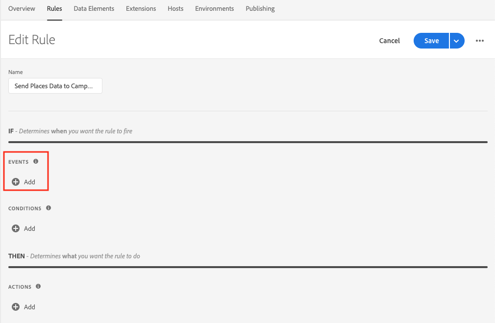
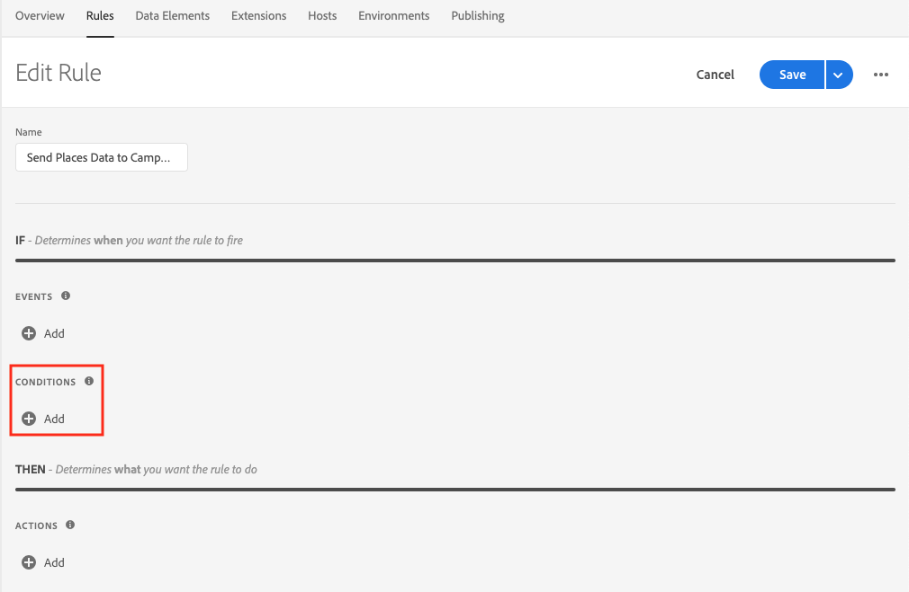
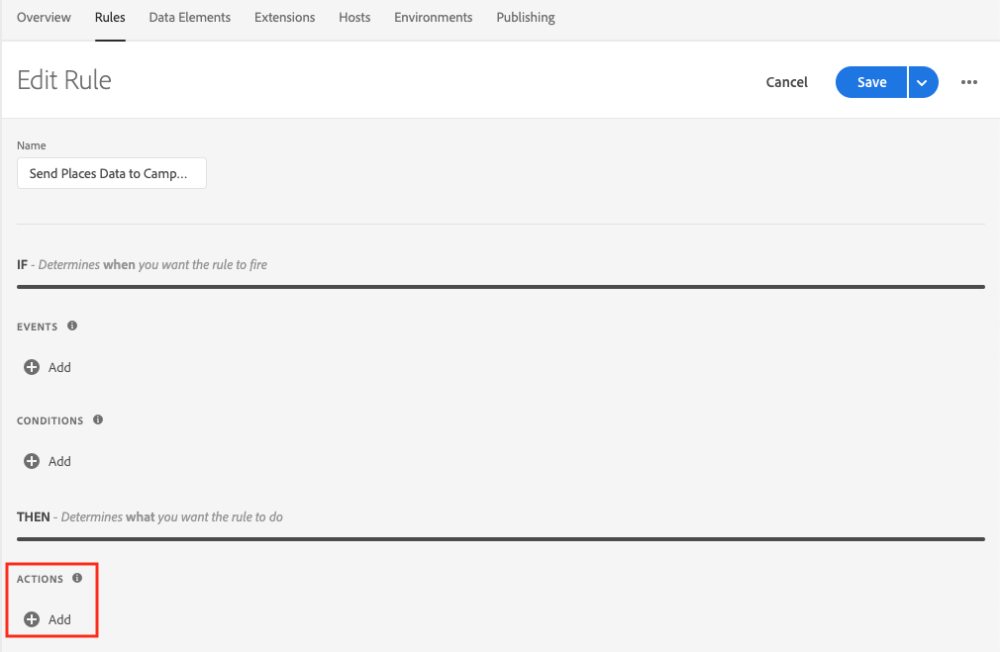

# Sending Places Data to Campaign via Launch Rules

This document assumes that you have Adobe Places implemented in your application. If you need help implementing Adobe Places, see [Places Extensions for AEP SDK](../../configure-places-in-the-sdk/README.md).

Once Places is sending in events for entries and exits, you can leverage Rules in Launch to send Places data to your Adobe Campaign servers. With your desired property selected in Launch, you can create this type of rule by completing four steps:

- [Create a new `Rule`](#create-a-rule)
- [Select the `Event` you wish to trigger the rule](#select-an-event)
- [Add any other `Conditions` required to trigger the action (optional)](#add-conditions)
- [Select the `Action` to Attach Data and define your payload](#define-the-action)

## Create a Rule

In the `Rules` tab, click the `Create New Rule` button.

If you don't have existing rules for this property, the button will be in the middle of the screen:

 

If your property already has rules, the button will be in the top right of the screen:

 

## Select an Event

You should give your rule a meaningful name so it will be easily recognizable in your list of Rules. This rule is named "Send Places Data to Campaign on Places Entry".

Next, click the "Add" button under the "Events" section:

 

Select `Places` from the "Extension" dropdown, then select `Enter POI` from the "Event Type" dropdown. No additional configuration is necessary, so hit the "Keep Changes" button.

 

## Add Conditions

If you wish to add `Conditions` to your rule, complete this step. If you don't, skip to [Define the Action](#define-the-action).

In this example, we will add a condition that will cause our rule to trigger only for users that are in the city named "San Jose".

Click the "Add" button under the "Conditions" section:

 

Select `Places` from the "Extension" dropdown, and choose `City` from the "Condition Type" dropdown. In the UI on the right, type "San Jose" and hit enter. When you're done, hit the "Keep Changes" button.

 

## Define the Action

The last thing we need to do is define the `Action`. First, click the "Add" button under the "Actions" section:

 

Select `Mobile Core` from the "Extension" dropdown and choose `Send Postback` from the "Action Type" dropdown.

We have to first provide the endpoint for our postback. In the URL field, enter the path to the correct table that will hold your location data in campaign. Constructing the correct URL is made easier by using data elements for your ACS Server and PKEY values.

Next, check the "Add Post Body" checkbox.

In the "Post Body" text area, add in the appropriate values that ACS is expecting in this table. The example below shows how you can use data elements to dynamically populate the `locationData` with correct values for this user.

 

Finally, set the "Content Type" to `application/json` and change the "Timeout" to a non-zero number - we recommend `2`.

Once you're finished, hit the "Keep Changes" button.

## Save the Rule and Rebuild your Property

Now that you are done with configuration, your screen should look like below:

 

The last thing for you to do is hit the "Save" button, then make sure to re-build your Launch property and deploy it to the correct Environment.
