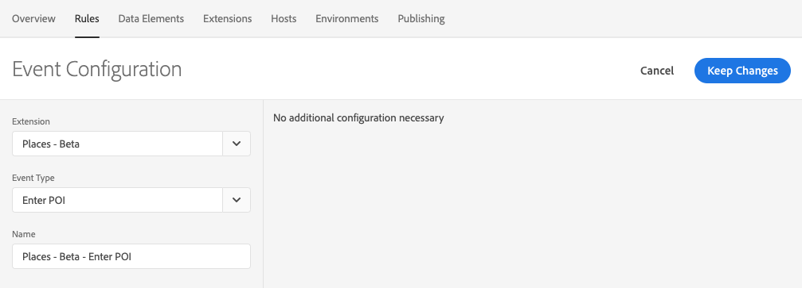
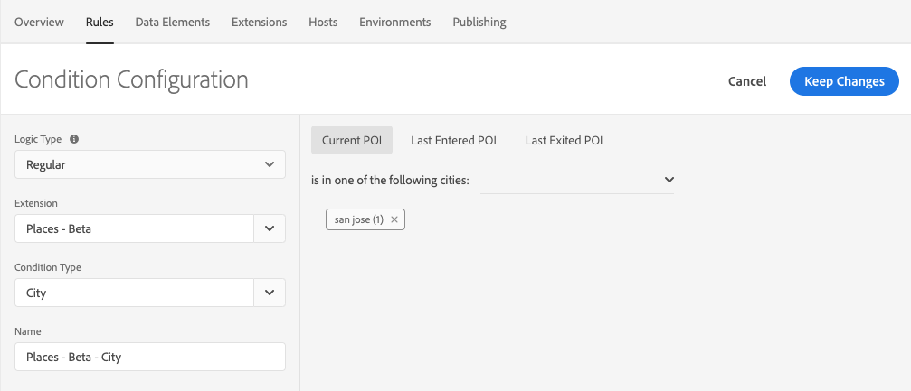
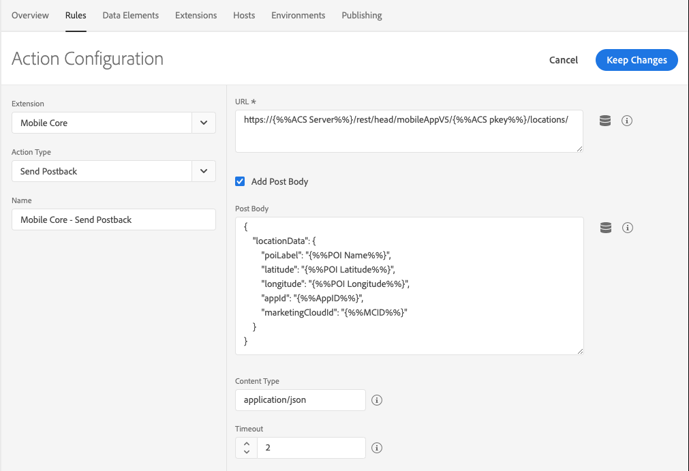
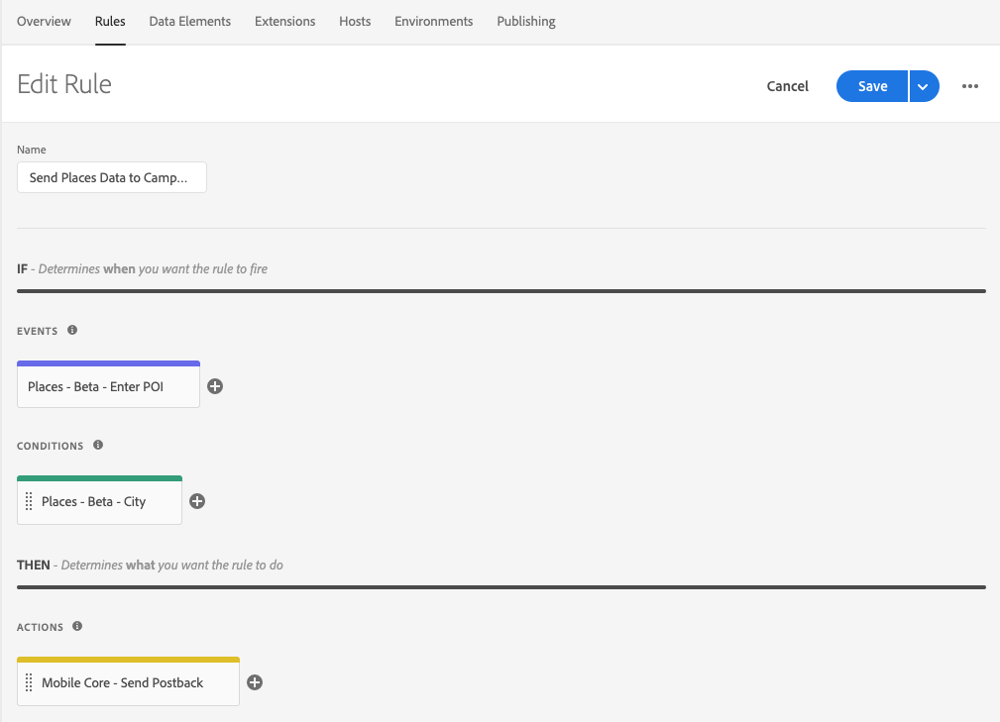

# Sending Places data to Campaign via Launch Rules


This document assumes that you have Adobe Places implemented in your application. For more information about implementing Adobe Places, see [Places Extensions for AEP SDK](../../configure-places-in-the-sdk/README.md).


After Places sends entry and exit events, you can leverage Rules in Launch to send Places data to your Adobe Campaign servers. To create this Rule, select your property in Launch, and complete the following steps:

1. [Create a new **Rule**](#create-a-rule)
2. [Select the **Event** you wish to trigger the rule](#select-an-event)
3. [Add any other **Conditions** required to trigger the action (optional)](#add-conditions)
4. [Select the **Action** to send a postback and define your payload](#define-the-action)

## Create a Rule

1. On the **Rules** tab, click **Create New Rule**.

Remember the following information:
- If you do not have existing rules for this property, the button will be in the middle of the screen.
- If your property has rules, the button will be in the top right of the screen.

## Select an Event

1. Give your rule a meaningful name so it will be easily recognizable in your list of Rules. In this example, the Rule is named **Send Places Data to Campaign on Places Entry**.

2. Under the **Events** section, click **Add**.

3. From the **Extension** drop-down list, select **Places**.

4. From the **Event Type** drop-down list, select **Enter POI**.

5. Click **Keep Changes**.

 

## Add Conditions


Complete this step if you want to add Conditions to your rule. Otherwise, skip to [Define the Action](#define-the-action).


In this example, a Condition is created that causes the Rule to trigger only for users that are in the city named **San Jose**.

1. Under the **Conditions** section, click **Add**.

2. From the **Extension** drop-down list, select **Places**.

3. From the **Condition Type** drop-down list, select **City**.

4. On the right pane, type **San Jose** and hit **Enter**.

5. Click **Keep Changes**.

 

## Define the Action

1. Under the **Actions** section, click **Add**.

2. From the **Extension** drop-down list, select **Mobile Core**.  

3. From the **Action Type** drop-down list, select **Send Postback**.

4. To provide the endpoint for our postback, in the **URL** field, enter the path to the correct table that will hold your location data in Campaign.

5. Select the **Add Post Body** checkbox.

6. In the **Post Body** field, add the appropriate values that Campaign Standard is expecting in this table.

7. In the **Content Type**, type **application/json**.

8. In **Timeout**, select a non-zero number, for example, **2**.

9. Click **Keep Changes**.

 

## Save the Rule and rebuild your Property

After you complete your configuration, verify that your Rule looks like the following image:

 

1. Click **Save**

2. Rebuild your Launch property and deploy it to the correct Environment.
