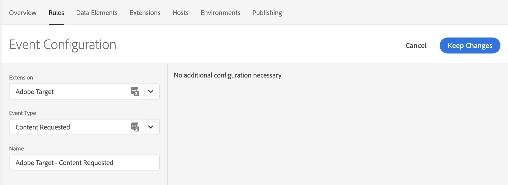
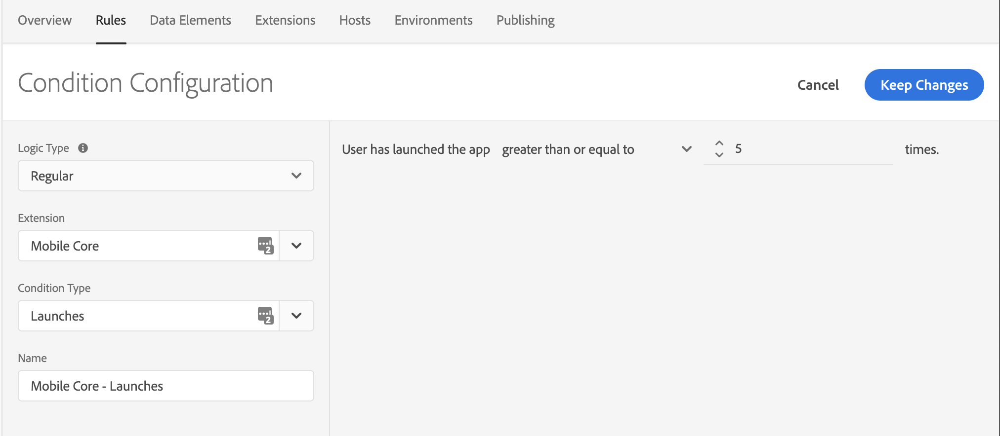
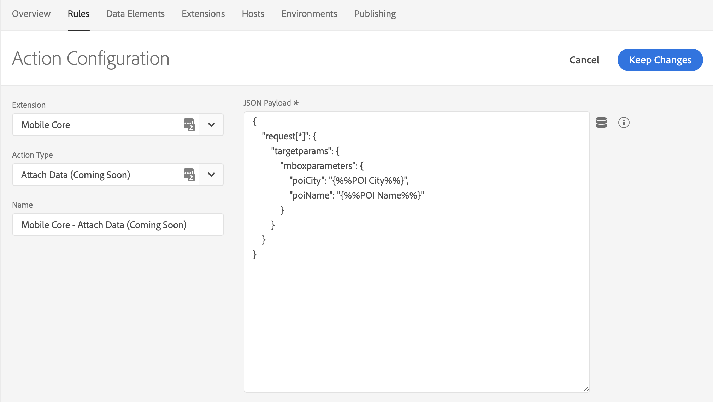
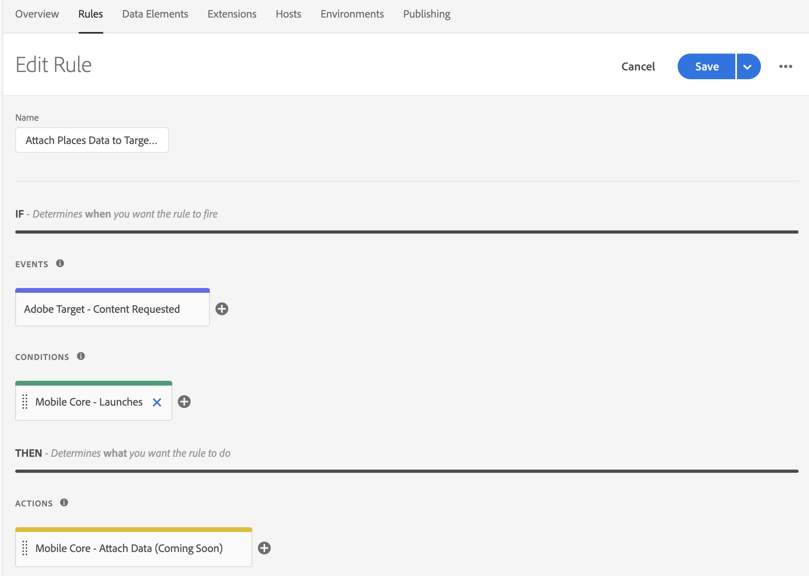

# Attaching Places data to Target Events via Launch Rules


This document assumes that you have Adobe Places implemented in your application. For more information about implementing Adobe Places, see [Places Extensions for AEP SDK](../../configure-places-in-the-sdk/README.md).


After Places sends entry and exit events, you can create rules in Experience Platform Launch to attach your Places data to your Adobe Target SDK events. To create this type of rule, select your property in Launch, and complete the following steps:

1. [Create a new **Rule**](#create-a-rule)
2. [Select the **Event** you wish to trigger the rule](#select-an-event)
3. [Add any other **Conditions** required to trigger the action (optional)](#add-conditions)
4. [Select the **Action** to Attach Data and define your payload](#define-the-action)

## Create a Rule

1. On the **Rules** tab, click **Create New Rule**.

Remember the following information:
- If you do not have existing rules for this property, the button will be in the middle of the screen.
- If your property has rules, the button will be in the top right of the screen.

## Select an Event

1. Give your rule a meaningful name so it will be easily recognizable in your list of Rules. In this example, the Rule is named **Attach Places Data to Target Content Requested**.

2. Under the **Events** section, click **Add**.

3. From the **Extension** drop-down list, select **Adobe Target**.

4. From the **Event Type** drop-down list, select **Content Requested**.

5. Click **Keep Changes**.

 

## Add Conditions


Complete this step if you want to add Conditions to your rule. Otherwise, skip to [Define the Action](#define-the-action).


In the following example, a Condition is created that causes the Rule to trigger only for users who have launched the app five or more times.

1. Under the **Conditions** section, click **Add**.

2. From the **Extension** drop-down list, select **Mobile Core**.

3. From the **Condition Type** drop-down list, select **Launches**.

4. On the right pane, modify the drop-down list and number controls so that the condition reads _User has launched the app greater than or equal to 5 times_.

5. Click **Keep Changes**.

 

## Define the Action

1. Under the **Actions** section, click **Add**.

2. From the **Extension** drop-down list, select **Mobile Core**.  

3. From the **Action Type** drop-down list, select **Attach Data**.

4. On the right pane, in the **JSON Payload** field, type the data that will be added to this Event.

5. Click **Keep Changes**.

On the right pane, you can add a freeform JSON payload that adds data to an SDK event before the extensions listening for this event hear it.

In the following example, **poiCity** and **poiName** values are added to the **mboxparameters** for each request that is processed in the Target event. The values for the new keys are determined dynamically by the SDK at the time this event processes.


This JSON payload uses a special notation for the **request** object. In the original event, **request** is an array of anonymous objects. When attaching data to all of objects in an array using Attach Data, the **[*]** notation on a key that is known to contain an array causes the payload to be applied to all objects in that array.

The notation of **request[*]** can be read out loud as _for each object in the **request** array_.


 

## Save the Rule and rebuild your Property

After you complete your configuration, verify that your Rule looks like the following image:

 

1. Click **Save**

2. Rebuild your Launch property and deploy it to the correct Environment.
