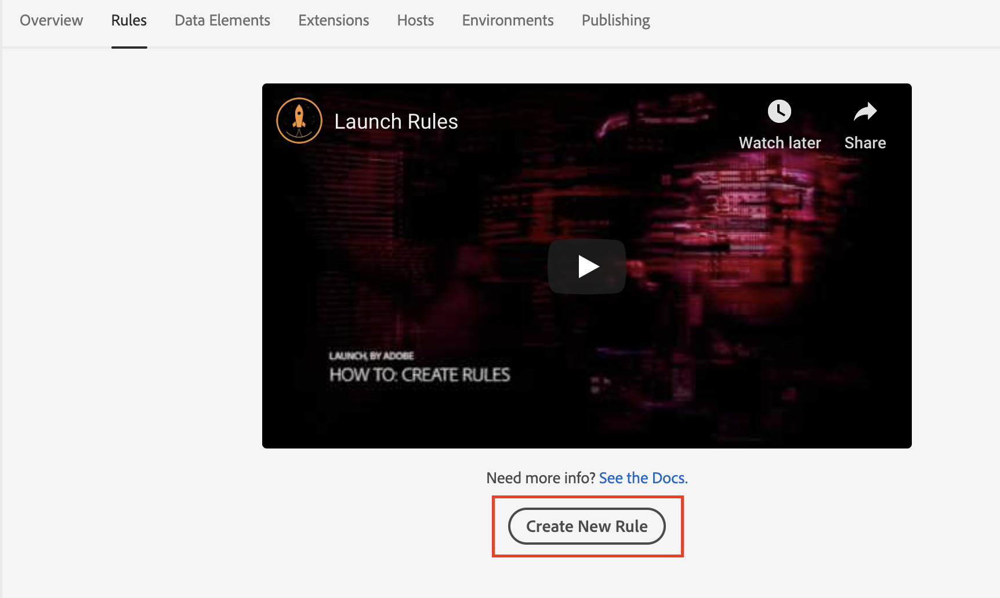
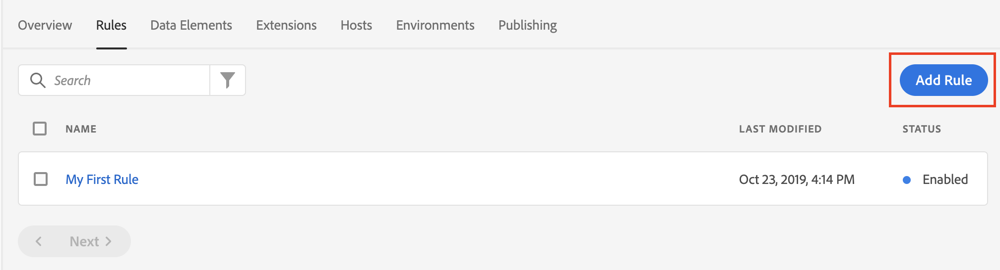
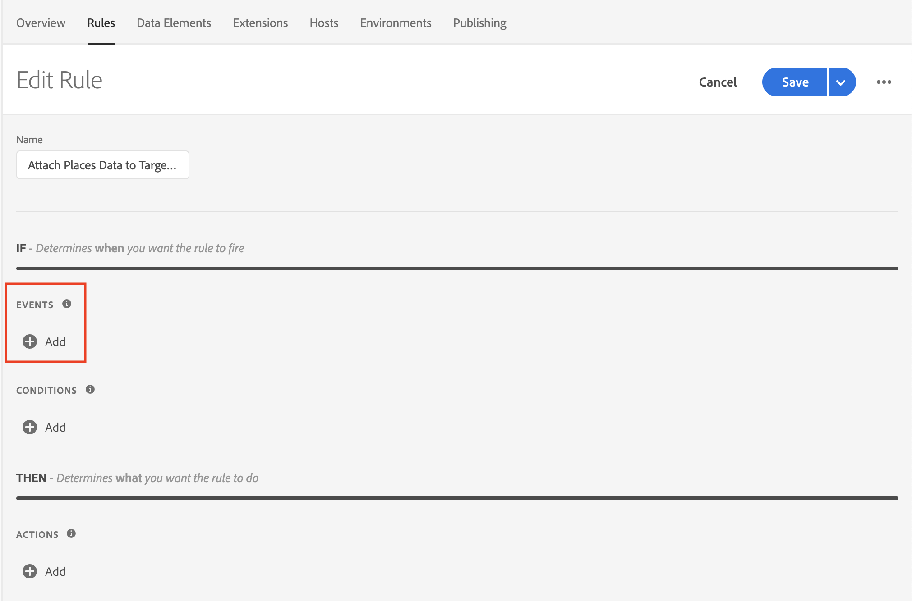
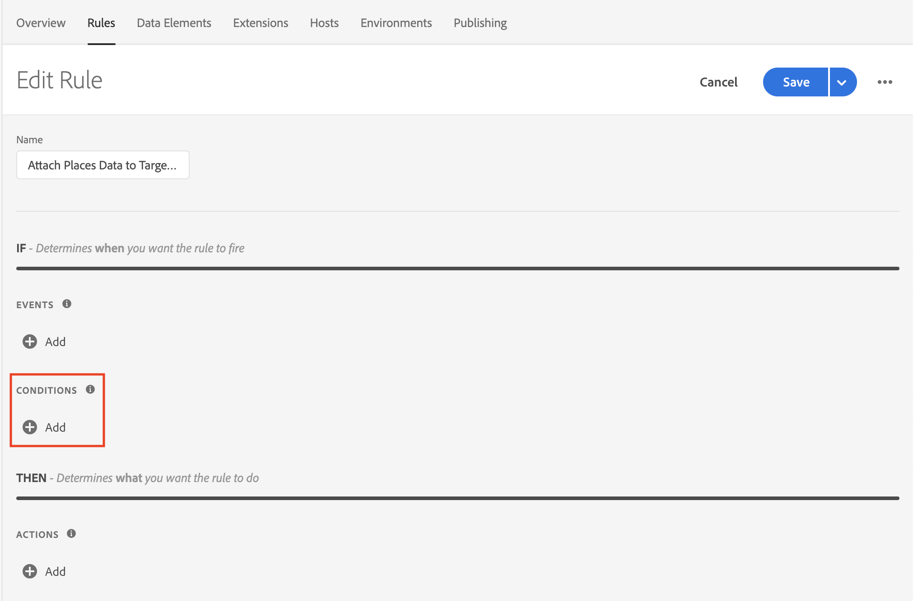
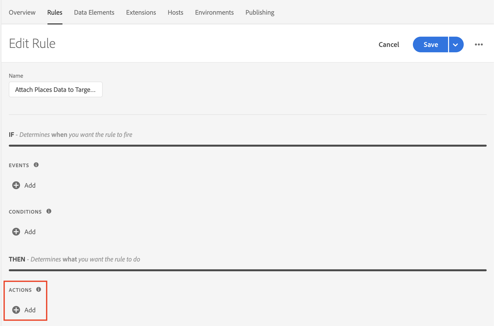

# Attaching Places Data to Target Events via Launch Rules

This document assumes that you have Adobe Places implemented in your application. If you need help implementing Adobe Places, see [Places Extensions for AEP SDK](../../configure-places-in-the-sdk/README.md).

Once Places is sending in events for entries and exits, you can leverage Rules in Launch to attach your Places data to your Adobe Target SDK events. With your desired property selected in Launch, you can create this type of rule by completing four steps:

- [Create a new `Rule`](#create-a-rule)
- [Select the `Event` you wish to trigger the rule](#select-an-event)
- [Add any other `Conditions` required to trigger the action (optional)](#add-conditions)
- [Select the `Action` to Attach Data and define your payload](#define-the-action)

## Create a Rule

In the `Rules` tab, click the `Create New Rule` button.

If you don't have existing rules for this property, the button will be in the middle of the screen:

 

If your property already has rules, the button will be in the top right of the screen:

 

## Select an Event

You should give your rule a meaningful name so it will be easily recognizable in your list of Rules. This rule is named "Attach Places Data to Target Content Requested".

Next, click the "Add" button under the "Events" section:

 

Select `Adobe Target` from the "Extension" dropdown, then select `Content Requested` from the "Event Type" dropdown. No additional configuration is necessary, so hit the "Keep Changes" button.

 

## Add Conditions

If you wish to add `Conditions` to your rule, complete this step. If you don't, skip to [Define the Action](#define-the-action).

In this example, we will add a condition that will cause our rule to trigger only for users that have launched the app five or more times.

Click the "Add" button under the "Conditions" section:

 

Select `Mobile Core` from the "Extension" dropdown, and choose `Launches` from the "Condition Type" dropdown. In the UI on the right, modify the dropdown and number controls so the condition reads "User has launched the app greater than or equal to 5 times". When you're done, hit the "Keep Changes" button.

 

## Define the Action

The last thing we need to do is define the `Action`. First, click the "Add" button under the "Actions" section:

 

Select `Mobile Core` from the "Extension" dropdown and choose `Attach Data` from the "Action Type" dropdown.

In the UI on the right, you have the ability to add a freeform JSON payload that will add data to an SDK event before any extension listening for this event will hear it. In our example, we are adding `mboxparameters` to all requests in this event before the Adobe Target extension process it. This results in each of the requests from this event having the new `mboxparameters` added on the outgoing Target request.

In the example below, we are adding "poiCity" and "poiName" values to the `mboxparameters` for each request processed in the Target event. The values for the new keys will be determined dynamically by the SDK at the time this event processes:

 


This JSON payload uses a special notation for the `"request"` object. In the original event, `"request"` is an array of anonymous objects. When attaching data to all of objects in an array using Attach Data, using the `[*]` notation on a key that is known to contain an array will cause the payload to be applied to all objects within that array.

The notation of `"request[*]"` can be read out loud as "for each object in the `request` array".


## Save the Rule and Rebuild your Property

Now that you are done with configuration, your screen should look like below:

 

The last thing for you to do is hit the "Save" button, then make sure to re-build your Launch property and deploy it to the correct Environment.
