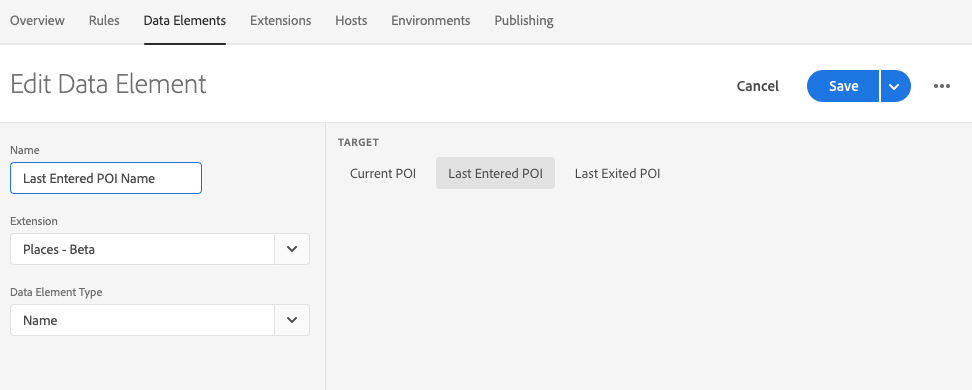
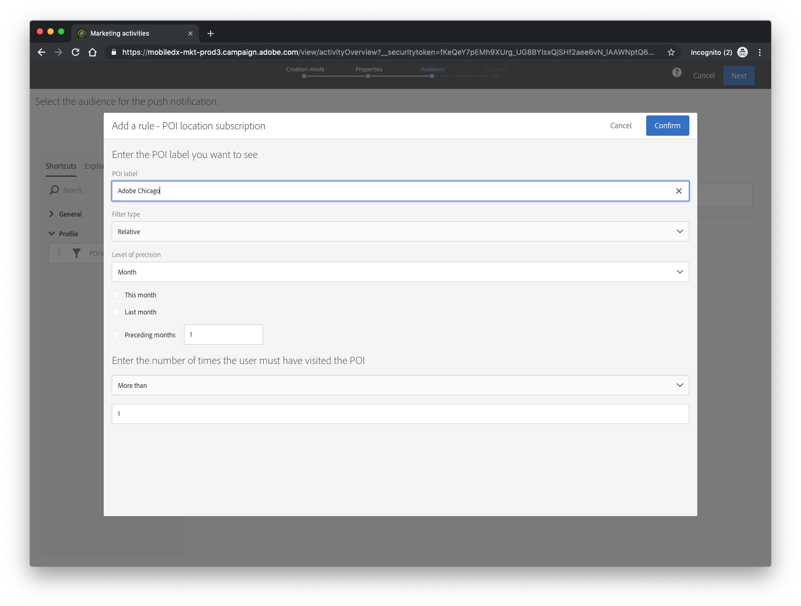
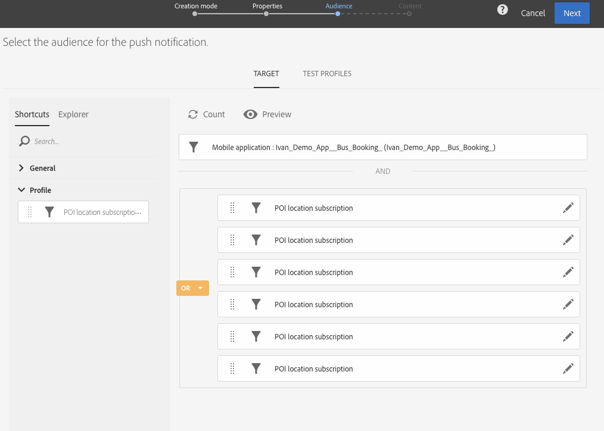
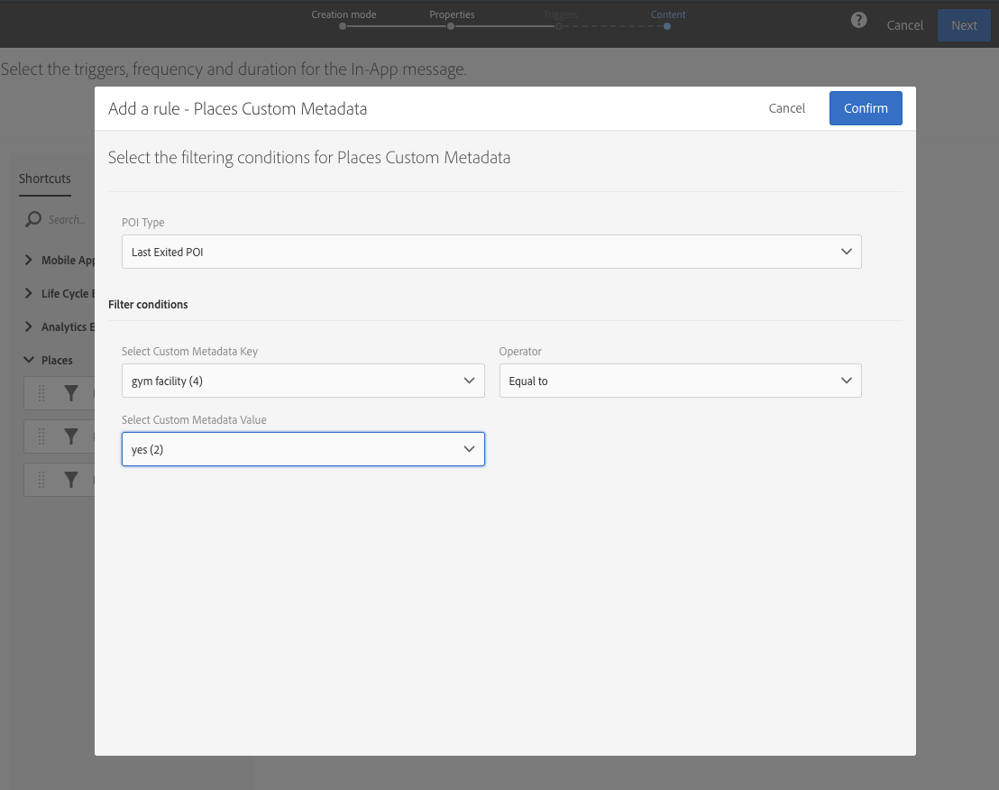

# Using Places with Adobe Campaign Standard


This content has permanently moved to [Push notifications ](https://docs.adobe.com/content/help/en/places/using/use-places-with-other-solutions/places-acs/places-acs-push-notifications.html)and [In-app messages](https://docs.adobe.com/content/help/en/places/using/use-places-with-other-solutions/places-acs/places-acs-in-app-messages.html), so that it can be in the same place as other Adobe Experience Cloud content and be translated into several languages.

Please update your bookmarks.


_Thanks for visiting us last week, we’d love to give you a surprise for use on your next visit!_

Having a deep understanding your customers preferences and habits are key to any successful marketing campaign. The items a user has searched for and previous purchase history play a major role in audience targeting. Knowing whether a user has visited a physical location can also add some valuable context when forming a relationship with the consumer.

According to a recent report from eMarketer, 85% of high-performing retailers believe that location is important to their marketing efforts. Additionally, over 58% of retailers in North America are planning to invest in proximity/location technologies to enhance their customer experiences.


Think about how critical location is in your smartphone usage experience. How often do ask your smartphone to find nearby restaurants, gas stations, grocery stores or other services?

It makes sense that as a brand you should be thinking of ways to leverage location in your marketing campaigns. In this guide, we’ll show how you can harness the power of Adobe Experience Platform Location Service to add location context to messaging through Adobe Campaign Standard, which allows you to blast out personalized push notifications or in-app messages based on historical point of interest entry.

Before we begin, this guide assumes that you have a mobile application configured with the Adobe Experience Platform Mobile SDK with the Adobe Campaign Standard extension. In addition to Adobe Experience Platform Mobile SDK and Campaign Standard, you should have access to the Adobe Experience Platform Location Services.

### **Prerequisites**

1. Integrate the [Adobe Experience Platform Mobile SDK](https://aep-sdks.gitbook.io/docs/getting-started/get-the-sdk) into your app.
2. Add the [Adobe Campaign Standard Extension](https://aep-sdks.gitbook.io/docs/using-mobile-extensions/adobe-campaign-standard) to your mobile app configuration.
3. [Create one or more POIs](https://placesdocs.com/places-services-by-adobe-documentation/places-database-management-1/managing-pois-in-the-places-ui#create-a-poi) in Adobe Experience Platform Location Services.


If you are looking for ways to bulk upload or manage POIs, take a look at this [script to upload POIs from a CSV](https://github.com/adobe/places-scripts) file. The [Location Service APIs](https://placesdocs.com/places-services-by-adobe-documentation/places-rest-apis) can also be used to create or manage points of interest.


If you do not have access to Adobe Experience Platform Location Services, you can [request access here](https://forms.office.com/Pages/ResponsePage.aspx?id=Wht7-jR7h0OUrtLBeN7O4fkr821yYptFo-ghlnlXCyhUM0dQVkJCSzVDMFNGWEFXWUUwNEJWSjhSRS4u).

## **Enable and install Places extensions in your application**

After creating points of interest in the Adobe Experience Platform Location Services interface, you will need to add the Places functionality to your application.

1. Follow the directions for enabling the Places and Places Monitor extensions in your application.
2. In the Places extension, make sure you select the appropriate library of POIs that you created previously.  Additional libraries can be added to the extension configuration at any time.
3. Ensure that you add these configurations to a Library and published the configuration changes in Experience Platform Launch
4. In the Experience Platform Launch **Environments** tab, under the **Install** column, click the icon for the environment to display the download instructions for the appropriate CocoaPod and Gradle files to your app project.
5. In your application, follow the instructions to add Location background mode to your application and start the Places Location Monitor.
6. Test your application through a device simulator to see the application request nearby POIs based on spoofing the device’s location.

## **Create data elements in Experience Platform Launch**

After you verify that the Places and Places Monitor extensions are working correctly in your application, create data elements in Experience Platform Launch. The data elements allow you to read the information that was provided by the extensions coming through the Mobile SDK event hub and act as an alias to retrieve data from the client application. Let’s create a few data elements to retrieve data from the Places extensions.

1. In of your Experience Platform Launch mobile property, click the **Data Elements** tab and click **Add Data Element**.
2. In the **Extension** drop-down list, select **Places**.
3. From the **Data Element Type** drop-down list, select **Name**.
4. In the right-hand side pane, you can select **Current POI** which retrieves the name of the POI in which the user is currently located.

   **Last Entered** retrieves the name of the POI that user last entered, and **Last Exited** provides the name of the POI that the user last left. For this example, we will selected **Last Entered** and typed a name for the data element, such as **Last Entered POI Name** and clicked **Save**.

   

5. Repeat the same steps above and create data elements for _Last Entered POI Latitude_, _Last Entered POI Longitude_, and _Last Entered POI Radius_.

In addition to the data elements for Places, ensure that you create Mobile Core data elements for _App ID_ and _Experience Cloud ID_.

## **Create a rule to send location data to Adobe Campaign Standard**

Rules in Experience Platform Launch allow you to create complex, multi-solution workflows based on event triggers. What’s great about rules, is that you can create new rules or modify existing ones and have the updates dynamically deployed to your mobile applications. In this example we’ll create a rule that will be triggered when a user enters a geo-fenced POI. After the rule is triggered, an update is sent to Campaign to record an entry to a specific POI for a particular user based on the Experience Cloud ID.

1. In your Launch mobile property click on the **Rules** tab and click **Add Rule**.
2. Under the **Events** section click **+** and select **Places** as the extension.
3. For the **Event Type** select **Enter POI**.
4. Name the rule, for example, **User entered POI**.
5. Click **Keep Changes**.
6. The **Conditions** section allows you to filter or place restrictions on when this rule should fire.  For now we will leave this blank.
7. Under the **Actions** section click **+** to create a new action
8. In the **Extension** drop-down list, select **Mobile Core,** and in the **Action Type** drop-down list, select **Send Postback**.
9. For the **URL**, you need to construct your Campaign Standard locations endpoint.  The URL should look similar to the one below. Ensure that you use the correct data elements that you created previously for your Campaign server and pKey. `https:///rest/head/mobileAppV5//locations/`
10. Click the box to add a post body and send the following:

    ```text
    {
     "locationData": {
     "distances": "{%%Last Entered POI Radius%%}",
     "poiLabel": "{%%Last Entered POI Name%%}",
     "latitude": "{%%Last Entered POI Lat%%}",
     "longitude": "{%%Last Entered POI Long%%}",
     "appId": "{%%AppID%%}",
     "marketingCloudId": “{%%ecid%%}”
     }
    }
    ```

11. Ensure that you are using your specific data elements that you created in the previous section.
12. In **Content Type**, type **application/json**.
13. Click **Keep Changes** after you have this set up.
14. I find it helpful to have a Slack web hook setup as an additional action to validate that my action is being triggered and that the right data is being collected.


Don’t forget to publish the recent changes to your app to make sure the rule and all of your data elements are deployed as part of your configuration. After publishing, you should launch the mobile application again to get the latest configuration updates.


## **Use location data to target Campaign Messages**

Now that we have location data populated in Campaign, we can use POIs as an audience segment tool.

1. In your Adobe Campaign Standard instance, click **Create Push Notification**.
2. For the push notification type, select **Send push to app subscribers**.

   This push type targets all users of your application. if your mobile users are attached to a Campaign profile, you can also select **Send push to Campaign profiles**.

3. Click **Next** and type the general details on the next screen.
4. On the Audience screen, click **Count** to see to how many estimated user the push notification will be sent.

   In this case, my count will equal three, as I have three devices that I have installed in which to test the application.

5. On the left sidebar, expand the **Profile** tab and drag the **POI location** filter to the main area
6. In the POI filter window, enter the exact name of the POI that you want to target.

   You can make additional selections to determine the range of time since the user’s last visit to this POI.

   

7. Click **Confirm**.
8. Run the count again at the top to see your audience size change.  If you do not se your count update, you might have entered a POI name for which no devices have triggered an entry. This is where having the Slack web hook becomes valuable, because you can see a listing of POI entries from various test devices.
9. You can drag out additional POI location filters to include multiple POIs in your message.
10. Click **Next** to finish creating the push notification for delivery.

    

## Receiving In-App messages

In addition to push notifications, you can also use location data to segment which users you would like to receive an in-app message.

1. In your Adobe Campaign Standard instance, click **Create In-App message**.
2. For the message type select **Target all users of a Mobile application**.
3. Click **Next** and type the general details on the next screen.
4. You’ll see on the left sidebar that you can now use a variety triggers related to Places.
5. I can choose to have the in-app message display if the user has entered a POI geo-fence
6. I can also use metadata that I defined in the Location Services UI to filter my audience.

   In this example I want to trigger an in-app message shown only to users that last exited a POI that also had a Gym facility. Perhaps I want to send them a survey to see if they used/liked the gym.

7. Click the **Next** to finish creating the in-app message for delivery.

   

Using Adobe Experience Platform Location Services with Adobe Campaign Standard gives you a powerful tool to segment and target your messaging to users based on historical location. This simple integration opens the door for building out more personalized and contextual use cases.

We’re constantly evolving the Adobe Experience Platform Location Services product and the solutions integrated to bring location context into mobile workflows. One product that will take advantage of Platform Location Services, is the upcoming Triggered Journey’s solution that will allow customers to create real-time workflows based on event triggers such as location.

### Recommended Links

Here are some links for additional information:

* [Adobe Experience Platform Location Service](https://www.adobe.com/experience-platform/location-service.html)
* [Adobe Campaign Standard](https://www.adobe.com/marketing/campaign.html)
* [Sign-up for access to Adobe Location Service Beta](https://forms.office.com/Pages/ResponsePage.aspx?id=Wht7-jR7h0OUrtLBeN7O4fkr821yYptFo-ghlnlXCyhUM0dQVkJCSzVDMFNGWEFXWUUwNEJWSjhSRS4u)
* [Adobe Experience Platform Mobile SDK](https://sdkdocs.com/)
* [Adobe Campaign integration with Experience Platform SDK](https://helpx.adobe.com/campaign/kb/configuring-app-sdk.html)

